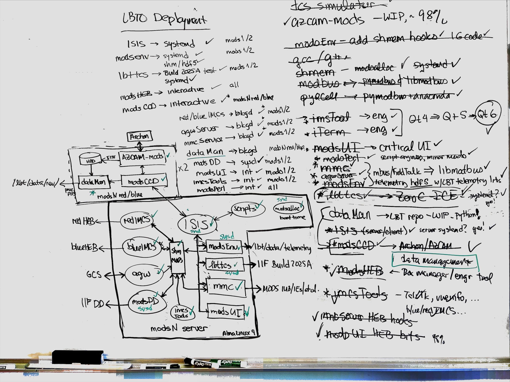

# MODS2025
Version 1.3.1

Last Update: 2025 Oct 4 [rwp/osu]

Lead: Richard Pogge (OSU Astronomy) pogge.1@osu.edu

See the [Release Notes](RELEASES.md) for details, as well as sub-system release notes inside.

## Overview
MODS2025 Project to update MODS1+2 CCD and instrument control systems at the LBT

**This our very messy working repository, not the final flight code repository that will be built later.  
Proceed at your own risk**

However, it is taking on many of the structures of the real thing, so not totally sloppy.  Sort of.

## Contents

### Core System

  * [ISIS](ISIS) - ISIS message-passing server and client
  * [mods](mods) - MODS instrument control and data-acquisition system
  * [azcam](azcam) - AzCam server for the MODS Archon CCD controllers
  * [modsPerl](modsPerl) - MODS perl scripts for target acquisition and data taking and related tasks.
  * [Scripts](Scripts) - MODS system startup and status scripts (work in progress)

### Development and Configuration

  * [Sandbox] - place to work on test codes and other bits we are using, the action is in the subfolders but read before you use
  * [Config] - released runtime configuration files (coming soon...)

## Installation and dependencies

See the [installation instructions](INSTALL.md) in this repository. 

## Authors and Contributors

- Rick Pogge (OSU Astronomy) pogge.1@osu.edu
- Xander Carroll (OSU Astronomy) carroll.892@osu.edu
- Jerry Mason (OSU Astronomy) mason.8@osu.edu
- Mike Lesser (UA, retired)
- Matthieu Bec (LBTO) mbec@lbto.org
- Glenn Eychaner (LBTO) geychaner@lbto.org
- Ray Gonzalez (OSU Retired)

## Whiteboard Status

MP4067 whiteboard as of 2025 Sept 21:

