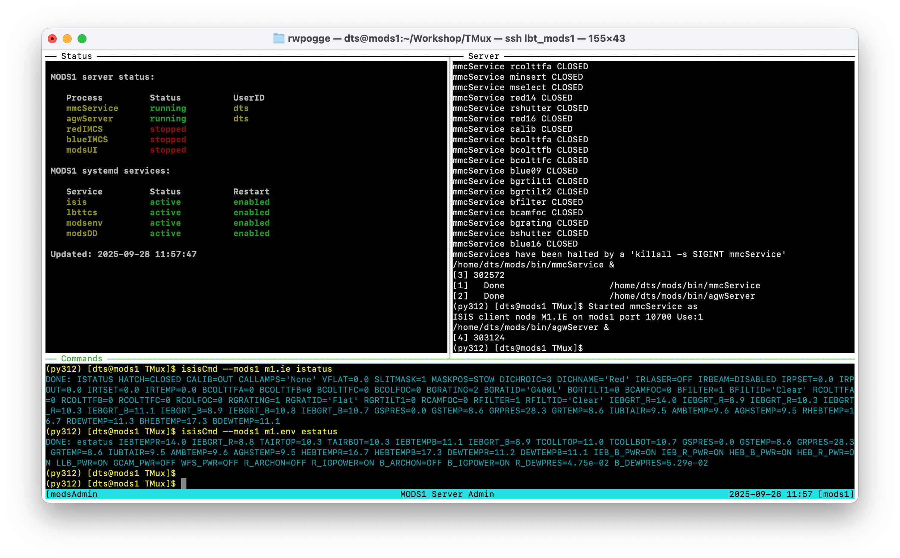

# `tmux` - terminal multiplexer notes for MODS2025

<b>started: 2025 Sept 25</b>

## Install:
```
sudo dnf -y install `tmux` 
```

## Useful Docs

The tmux(1) helpfile: https://man.openbsd.org/tmux (big, bad, useful)

RedHat beginner's guide to `tmux`: https://www.redhat.com/en/blog/introduction-tmux-linux

A helpful cheatsheet: https://tmuxcheatsheet.com/

Customization: 
 * status bar customization - https://www.baeldung.com/linux/tmux-status-bar-customization

## Development apps

 * `modsTerm` - first cut at a 3-pane `tmux` session for MODS admin

An experiment with `modsTerm` used an test script named `simBinoMODS` (see Tests/) to see how
two-frame execution of binary "observing" would go.  (Answer: great, getting to beta testing soon).

### MODS instrument server apps

These are designed to run on the `mods1` and `mods2` instrument server machines, replacing the old
versions of the same name for the Archon controller MODS.

 * `mods1` and `mods2` - `tmux` implementations of the pre-Archon startup and shutdown scripts, derived from `modsTerm`
 * `modsStatus.pl` - perl script using `Curses` that makes a dynamic status display for a modsN server.  Used by `mods1` and `mods2`

### Archon Server apps

These are designed to run on the `mods1blue` et al. machines for running the Archon controllers.

 * `ccdTerm` - first cut at a MODS Archon server admin panel that will run `azcam` and `modsCCD` on a `modsN<chan>` server.

## `tmux` config files

Collection of `.tmux.conf` files for use with MODS custom tmux sessions

## Screenshots

### `mods1` server admin session

Screenshot of a live test of the MODS1 instrument server admin tmux session.  This is the session that is created/attached
by the new version `mods1` startup script.  It is shown after firing up MODS1's mechanism servers.  

The upper left panel is running `modsStatus.pl`, a persistent status display that updates every 1-2 seconds.  The upper right panel is where
user processes (except modsUI) are executed, showing whatever they print to the screen during startup or shutdown without.  The bottom panel
is where user's type commadn (like `mods1` to start/stop services, or `isisCmd` to send commands to the data-taking system).

This screenshot was taken of a VPN ssh session from the author's home computer logged into the `mods1` server at LBT.  Because it works
with a terminal, not a screen share, it is fast and sharp.



## Miscellany

### Experiments and tests

The `Tests/` folder has working files from various tests.  Don't execute, but shows how I solved some problems.

### useful `.bashrc` shell aliases

`tmux` is not always intuitive, and users only accustomed to regular xterm shells can inadvertently do bad things
that obviate the advantages of having an asynchronously multiplexed terminal (`tmux`).  These aliases make getting
out of `tmux` safe for the way we use them with MODS

#### Safe detach/exit aliases

```shell
alias detach="tmux detach"
alias quit="tmux detach"

function exit {
  if [ ${TMUX} ]; then
    tmux detach
  else
    builtin exit
  fi
}
```
The first two aliases are intuitive ways to exit the tmux session and return to the original 
xterm shell (where you logged in remotely via ssh). They hide either the command versions
of "detaching" (`tmux detach`) if users dont' know the `Ctrl-B d` keyboard shortcut.

The redefinition of `exit` ensures that if someone is not paying attention and types "exit" in a tmux
session thinking they are detaching and logging off the remote ssh session, it doesn't exit the
bash shell running in the active pane and then closing the pane.

If the user is in a `tmux` pane, it detaches the session and returns to the original xterm shell,
but in an xterm shell exit reverts to the `builtin` function and they exit the ssh session and leave
the `tmux` session running along with its data-taking system processes.

### Custom ls colors that improve visibility in dark mode

We run the MODS `tmux` admin and control sessions to distinguish them from
regular xterm shells.  This can have issues for readability when doing `ls` with
color-coded output.  This is a very minor rework of the default `LS_COLORS` that
ensures legibility.

```shell
LS_COLORS='rs=0:di=01;36:ln=01;36:mh=00:pi=40;33:so=01;35:do=01;35:bd=40;33;01:cd=40;33;01:or=40;31;01:mi=00:su=37;41:sg=30;43:ca=30;41:tw=30;42:ow=34;42:st=37;44:ex=01;32:*.tar=01;31:*.tgz=01;31:*.arc=01;31:*.arj=01;31:*.taz=01;31:*.lha=01;31:*.lz4=01;31:*.lzh=01;31:*.lzma=01;31:*.tlz=01;31:*.txz=01;31:*.tzo=01;31:*.t7z=01;31:*.zip=01;31:*.z=01;31:*.dz=01;31:*.gz=01;31:*.lrz=01;31:*.lz=01;31:*.lzo=01;31:*.xz=01;31:*.zst=01;31:*.tzst=01;31:*.bz2=01;31:*.bz=01;31:*.tbz=01;31:*.tbz2=01;31:*.tz=01;31:*.deb=01;31:*.rpm=01;31:*.jar=01;31:*.war=01;31:*.ear=01;31:*.sar=01;31:*.rar=01;31:*.alz=01;31:*.ace=01;31:*.zoo=01;31:*.cpio=01;31:*.7z=01;31:*.rz=01;31:*.cab=01;31:*.wim=01;31:*.swm=01;31:*.dwm=01;31:*.esd=01;31:*.jpg=01;35:*.jpeg=01;35:*.mjpg=01;35:*.mjpeg=01;35:*.gif=01;35:*.bmp=01;35:*.pbm=01;35:*.pgm=01;35:*.ppm=01;35:*.tga=01;35:*.xbm=01;35:*.xpm=01;35:*.tif=01;35:*.tiff=01;35:*.png=01;35:*.svg=01;35:*.svgz=01;35:*.mng=01;35:*.pcx=01;35:*.mov=01;35:*.mpg=01;35:*.mpeg=01;35:*.m2v=01;35:*.mkv=01;35:*.webm=01;35:*.webp=01;35:*.ogm=01;35:*.mp4=01;35:*.m4v=01;35:*.mp4v=01;35:*.vob=01;35:*.qt=01;35:*.nuv=01;35:*.wmv=01;35:*.asf=01;35:*.rm=01;35:*.rmvb=01;35:*.flc=01;35:*.avi=01;35:*.fli=01;35:*.flv=01;35:*.gl=01;35:*.dl=01;35:*.xcf=01;35:*.xwd=01;35:*.yuv=01;35:*.cgm=01;35:*.emf=01;35:*.ogv=01;35:*.ogx=01;35:*.aac=00;36:*.au=00;36:*.flac=00;36:*.m4a=00;36:*.mid=00;36:*.midi=00;36:*.mka=00;36:*.mp3=00;36:*.mpc=00;36:*.ogg=00;36:*.ra=00;36:*.wav=00;36:*.oga=00;36:*.opus=00;36:*.spx=00;36:*.xspf=00;36:';

export LS_COLORS
```


