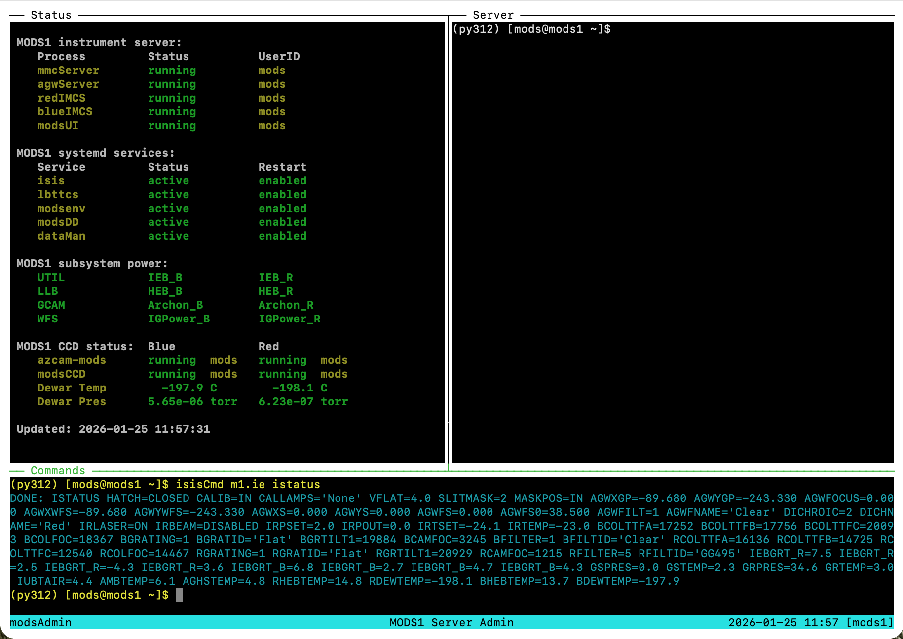

# MODS observing and support scripts

Latest Version: 2026 Jan 25 [rwp/osu]

See [Release Notes](releases.md) for the current verison

## Overview

...

All scripts are designed so that if executed without arguments they
will print a usage message.  This is the same as using the -h (--help)
option.

## Installation

### MODS Servers

...

### Public SciOps Folder

The robs/obs machines at the LBTO summit used for observing and
routine technical operations use the NFS-mounted `/lbt/lbto/mods`
folder for all public MODS scripts and support files (e.g., the tmux
config files).

This folder is autosynced daily at 1900UTC with the LBTO GitHub
(https://github.com/LBTO/sciops-obs-mods) repository.  Any changes to
scripts made before 1900UTC will make it into the daily autosync.
Read the [sciops-obs-mods README](https://github.com/LBTO/sciops-obs-mods/blob/master/README.md)
before pushing scripts into this folder, and be mindful of what you
put there and why.

## Dependences

Requires
 * `tmux` for terminal multiplexing for server admin and scripting engines
 * `xterm-resize` (if absent) for xterm resizing in-situ (helps tmux sessions)

## Runtime Environment

The MODS operations scripts to not require custom shell environment variables.

By default, it assumes that the system Perl (/usr/bin/perl) is the correct version to use.

## Script overview and usage

coming soon...

### `mods1` and `mods2` server admin

There are two versions of these scripts

#### Instrument server admin

These versions run only on the MODS1 and MODS2 instrument servers, and rely on local
system functions.  They cannot be reaily run remotely, except via a remote login session
(ssh) by a privileged user (e.g., `mods`).  These run in custom `tmux` sessions
(`modsAdmin`) that provide basic windowed organization for engineering-level admin
of instrument server functions.

#### Instrument status updates and user GUI

These are versions that live in the general public SciOps path for MODS (`/lbt/lbto/mods`)
that provide access to basic status info and the ability of observing users to run
an instance of the MODS GUI for each MODS.

The public scripts login via ssh to one of the MODS instrument servers to execute programs
that provide information on the instrument server state (`status`), instrument temperatures
and pressures (`temps`), and allow the user to start or stop the GUI (`start gui` and `stop gui`).

Unprivileged users are not permitted to execute these functions.

In a departure there are no longer individual LBTO member logins, but instead a single "observer"
login to handle MODS server functions for observers. SciOps users login to the approriate
operations account on the servers as before.

### MODS GUI

To make sure only 1 instance of the `modsUI` MODS instrument GUI is run at a time, we execute `modsUI` using a
wrapper named `modsGUI.sh`.

Usage Syntax:
 * `modsGUI start` - start the modsUI for that instrument on the server. Prevents running more than one at a time
 * `modsGUI stop` - stops a running modsUI on an instrument
 

### Status Scripts

#### `modsStatus.pl`

Perl script run on the instruent servers, either in xterm or tmux session, to show running instrument
server status.  Uses perl `Curses` to provide tabular, color-coded status info.

This script is usually invoked by the `mods1` or `mods2` admin scripts run on the servers in a
`modsAdmin` tmux session.

#### `mtStatus.pl`

Perl script to provide status information in ASCII text table format.  This version of the script
is used by remote observers to get a quick status snapshot using the `mods1 status` command on
a non-MODS observatory machine.

### Observing Scripts

#### `modsTerm`

Launches a multi-pane `modsTerm` tmux session used for running MODS
scripts with `acqBinoMODS` or `execBinoMODS`. Using a `tmux` session
keeps the script progress and error messages resident in a persistent
tmux (terminal multiplexer) session that may be detached and joined as
needed.

#### `acqBinoMODS`

Wrapper shell script to execute a binocular target acquisition in a
`modsTerm`.  It takes one or two .acq scripts on the command line and
executes `acqMODS` with the correct instrument and binocular context
options.  If one .acq script is given, it executed on both MODS
("twinning").  If two .acq scripts are given, they are implicitly
executed in the order MODS1 MODS2.

#### `execBinoMODS`

Wrapper shell script to execute a binocular observation or instrument
configuration script in a `modsTerm`.  It takes one or two .obs
scripts or 1 or 2 .img scripts on the command line and executes
`execMODS` with the correct instrument and binocular context options.
Note that you cannot mix .obs and .acq scripts with execBinoMODS.  If
one .acq script is given, it executed on both MODS ("twinning").  If
two .acq scripts are given, they are implicitly executed in the order
MODS1 MODS2.

### Archon CCD data-taking system scripts

#### `ccdTerm`

Launches a multi-pane `ccdTerm` tmux session used for running the MODS
Archon CCD systems on one of the four Archon servers (`mods1blue` et
al.).  The upper left panel runs the `modsCCD` interface agent (the
replacement for the old DOS "IC" program), and the upper right panel
runs the `azcam-mods` server session.  There is one `ccdTerm` session
per MODS channel, 4 in total.

#### `start_ccd`

Use `start_ccd` to start `azcam-mods` and `modsCCD` in the correct
order in a running `ccdTerm`. We must start the `azcam-mods` server
before starting the `modsCCD` agent.  This makes sure that happens
with the correct time delays.

It requires that it is being run in an active `ccdTerm` tmux session
and stops the user if that is not the case, with corrective
instructions.

#### `stop_ccd`

Use `stop_ccd` to shutdown `modsCCD` and `azcam-mods` gracefully in
the correct order. We must stop `modsCCD` first, then `azcam-mods`.
If reverse, `azcam-mods` hangs until `modsCCD` quits and releases the
TCP client socket.

#### Agent-level start scripts

`start_azcam` and `start_modsccd` allow engineering users to start
the `azcam-mods` server and `modsCCD` agents separately.  Should
only be used for engineering work. `modsCCD` will make sure an
`azcam-mods` server is running before starting, so does ensure
logical order of execution, and checks that a `ccdTerm` tmux
session is running and you are in it when giving these commands.

### MODS Dashboard GUI scripts

`modsGUI` is used to start/stop/check the MODS GUI dashboard program
on an instrument server (`mods1` or `mods2`). Only used directly when
logged into a MODS instrument server for engineering work.

The public `mods1` and `mods2` scripts are used by observers to launch
the MODS dashboard GUIs from operations machines (robs and obs) for
routine observing operations. These public scripts run the `modsGUI`
in a detached ssh secure shell.

### Support Scripts

These are scripts for instrument support operations by LBTO support
scientists and support personnel.  Used to do system configuration
(like updating slitmask tables) and running low-level engineering
support tools like the IMCS monitor GUIs.

#### `modsAdmin`

This is a public script that will run the `modsStatus` monitor
programs for MODS1 and MODS2 in a dedicated tmux session that is
executed on an operations workstation (robs or obs machine).  This
provides a "one-window" dual-instrument monitor and low-level command
application for running `isisCmd` to operate a MODS at the lowest
levels, bypassing the GUI.

#### `imcsTools`

These launch the IMCS monitor GUIs on a MODS server.  The script makes
sure they are run only on the `mods1` and `mods2` instrument servers
by authorized users.  Engineering versions can only be run logged into
the instrument servers, but a more restricted public version may be
run at need from the operations machines (robs or obs) at need.

#### `updateSlits`

Used by support personnel to instruct the running MMC server instances
to read the slitmask tables after a slit mask exchange.  Enabled to
run from the operations machines (robs or obs).

#### `pingMODS1` and `pingMODS2`

Scripts to ping the internal TCP/IP ports on the WAGO and Comtrol
units in the MODS instruments. Used to provide a low-level "test of life"
for critical interface hardware.

#### `pokeMODS1` and `pokeMODS2`

These do a low-level "poke" (query status of) all MODS1 mechanisms via ISIS and the MMC
server.  This is a quick way to check for dangling sockets.  Use is restricted to
the to the ISP user account (lbto).

## Screenshots

### `mods1` server admin session

Screenshot of a live test of the MODS1 instrument server admin tmux
session.  This is the session that is created/attached by the new
version `mods1` startup script. It is shown with nearly all of the
MODS1 system, including the Archon controllers and modsCCD agents,
running, but the modsUI GUI not yet started.  This shows that
the various programs were started by the `mods` support user.

The upper left panel is running `modsStatus.pl`, a persistent status
display that updates every 2-3 seconds.  The upper right panel is
where user processes (except modsUI) are executed, showing whatever
they print to the screen during startup or shutdown without.  The
bottom panel is where a support user would type simple commands,
like `mods1` to start/stop services, or `isisCmd` to send low-level
commands to the data-taking system.  It is not meant as a general
terminal window. If you need to do more complex tasks, like editing
slitmask tables and the like, login to the mods1 or mods2 server
machine with ssh and use a regular terminal.

This screenshot was taken of a VPN ssh session from the author's home
computer logged into the `mods1` server at LBT.  Because it works with
a terminal, not a remote desktop app like x2go or vncviewer, it is
very fast and sharp, with very little network lag.

### `modsAdmin` monitor session

This shows a `modsAdmin` tmux session launched by the `lbto` user
while remotely logged into the `robs1` Linux workstation on the
mountain.  The two upper panels show the live MODS server status
windows for MODS1 (left) and MODS2 (right).  These panes are remotely
logged into the respective MODS servers via ssh.

The lower pane is a **local** command window running (in this example)
on `robs1` as user `lbto`.  Test appears yellow to indicate that this
is the active pane, with the usual Linux command prompt the lbto user would
see in a terminal shell on robs1.

The purpose of `modsAdmin` is a quick-look status display for the support
astronomer to make sure all MODS system are running on both instruments,
and a quick readout of the dewar temperature and pressure.  While it can
be used for low-level admin commands for a MODS, it is not meant to be used
for tasks like editing MODS files, running observing scripts, etc.

