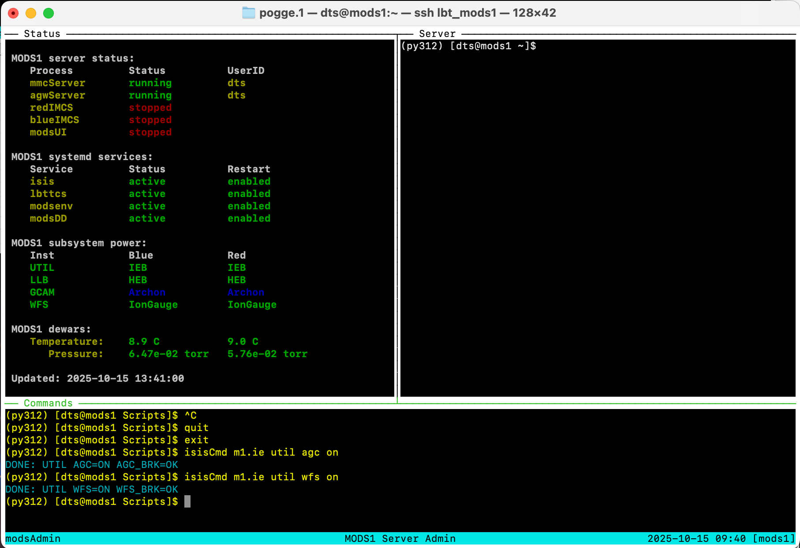

# MODS operations scripts

Latest Version: 2025 Oct 16 [rwp/osu]

See [Release Notes](releases.md) for the current verison

## Overview

...

All scripts are designed so that if executed without arguments they
will print a usage message.  This is the same as using the -h (--help)
option.

## Installation

### MODS Servers

...

### Public SciOps Folder

...

## Dependences

Requires
 * `tmux` for terminal multiplexing for server admin and scripting engines
 * `xterm-resize` (if absent) for xterm resizing in-situ (helps tmux sessions)

## Runtime Environment

The MODS operations scripts to not require custom shell environment variables.

By default, it assumes that the system Perl (/usr/bin/perl) is the correct version to use.

## Script overview and usage

coming soon...

### `mods1` and `mods2` server admin

There are two versions of these scripts

#### Instrument server admin

These versions run only on the MODS1 and MODS2 instrument servers, and rely on local
system functions.  They cannot be reaily run remotely, except via a remote login session
(ssh) by a privileged user (e.g., `mods`).  These run in custom `tmux` sessions
(`modsAdmin`) that provide basic windowed organization for engineering-level admin
of instrument server functions.

#### Instrument status updates and user GUI

These are versions that live in the general public SciOps path for MODS (`/lbt/lbto/mods`)
that provide access to basic status info and the ability of observing users to run
an instance of the MODS GUI for each MODS.

The public scripts login via ssh to one of the MODS instrument servers to execute programs
that provide information on the instrument server state (`status`), instrument temperatures
and pressures (`temps`), and allow the user to start or stop the GUI (`start gui` and `stop gui`).

Unprivileged users are not permitted to execute these functions.

In a departure there are no longer individual LBTO member logins, but instead a single "observer"
login to handle MODS server functions for observers. SciOps users login to the approriate
operations account on the servers as before.

### MODS GUI

To make sure only 1 instance of the `modsUI` MODS instrument GUI is run at a time, we execute `modsUI` using a
wrapper named `modsGUI.sh`.

Usage Syntax:
 * `modsGUI start` - start the modsUI for that instrument on the server. Prevents running more than one at a time
 * `modsGUI stop` - stops a running modsUI on an instrument
 

### Status Scripts

#### `modsStatus.pl`

Perl script run on the instruent servers, either in xterm or tmux session, to show running instrument
server status.  Uses perl `Curses` to provide tabular, color-coded status info.

This script is usually invoked by the `mods1` or `mods2` admin scripts run on the servers in a
`modsAdmin` tmux session.

#### `mtStatus.pl`

Perl script to provide status information in ASCII text table format.  This version of the script
is used by remote observers to get a quick status snapshot using the `mods1 status` command on
a non-MODS observatory machine.

### Observing Scripts

#### `acqBinoMODS`

Wrapper shell script to execute a binocular target acquisition in a
`modsTerm`.  It takes one or two .acq scripts on the command line and
executes `acqMODS` with the correct instrument and binocular context
options.  If one .acq script is given, it executed on both MODS
("twinning").  If two .acq scripts are given, they are implicitly
executed in the order MODS1 MODS2.

#### `execBinoMODS`

Wrapper shell script to execute a binocular observation or instrument
configuration script in a `modsTerm`.  It takes one or two .obs
scripts or 1 or 2 .img scripts on the command line and executes
`execMODS` with the correct instrument and binocular context options.
Note that you cannot mix .obs and .acq scripts with execBinoMODS.  If
one .acq script is given, it executed on both MODS ("twinning").  If
two .acq scripts are given, they are implicitly executed in the order
MODS1 MODS2.

#### `modsTerm`

Launches a multi-pane `modsTerm` tmux session used for running MODS
scripts with `acqBinoMODS` or `execBinoMODS`. Using a `tmux` session
keeps the script progress and error messages resident in a persistent
tmux (terminal multiplexer) session that may be detached and joined as
needed.

#### `ccdTerm`

Launches a multi-pane `ccdTerm` tmux session used for running the MODS
Archon CCD systems on one of the four Archon servers (`mods1blue` et
al.).  The upper left panel runs the `modsCCD` interface agent (the
replacement for the old DOS "IC" program), and the upper right panel
runs the `azcam-mods` server session.  There is one `ccdTerm` session
per MODS channel, 4 in total.

## Screenshots

### `mods1` server admin session

Screenshot of a live test of the MODS1 instrument server admin tmux
session.  This is the session that is created/attached by the new
version `mods1` startup script.  It is shown after firing up MODS1's
mechanism servers.

The upper left panel is running `modsStatus.pl`, a persistent status
display that updates every 1-2 seconds.  The upper right panel is
where user processes (except modsUI) are executed, showing whatever
they print to the screen during startup or shutdown without.  The
bottom panel is where user's type command (like `mods1` to start/stop
services, or `isisCmd` to send commands to the data-taking system).

This screenshot was taken of a VPN ssh session from the author's home
computer logged into the `mods1` server at LBT.  Because it works with
a terminal, not a screen share, it is fast and sharp.

